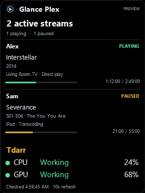
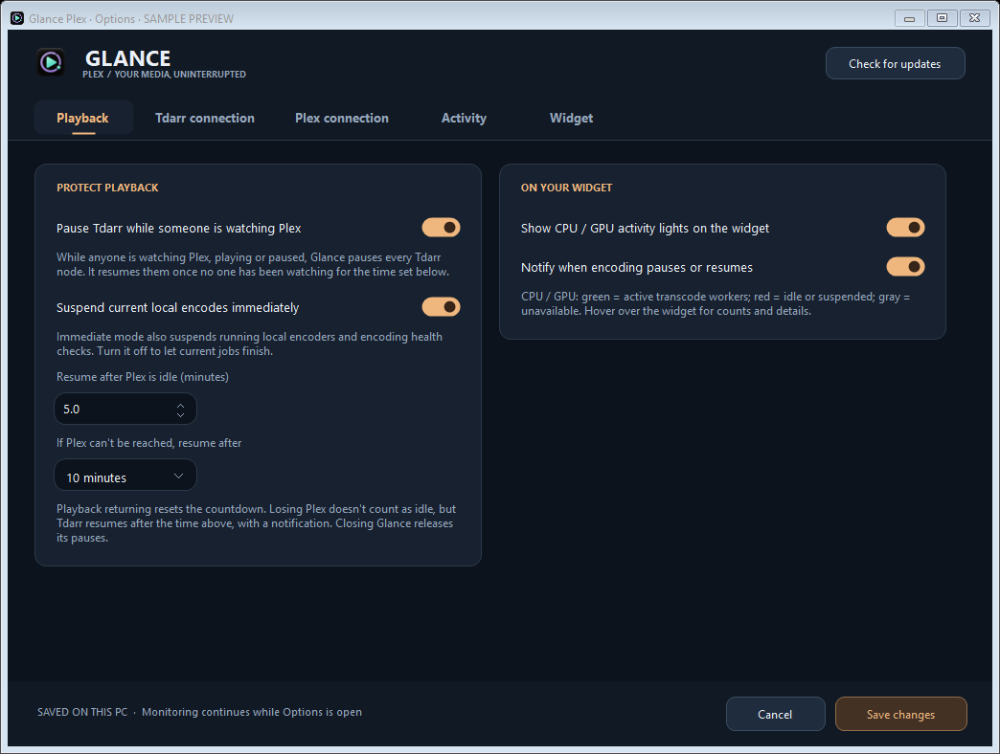
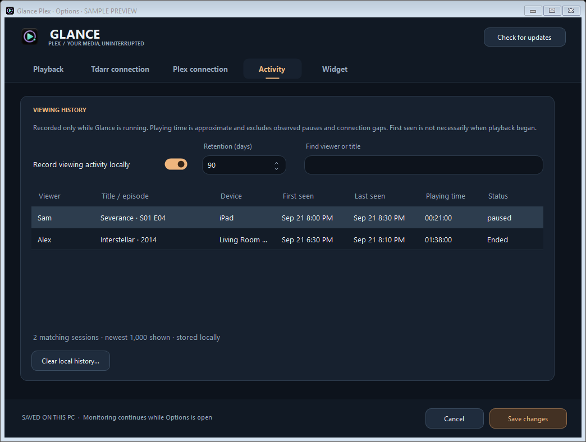
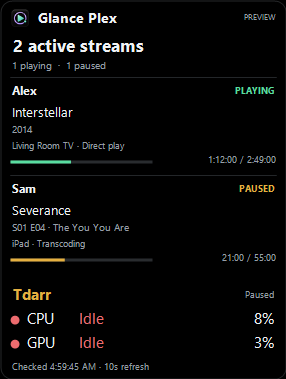
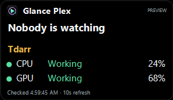
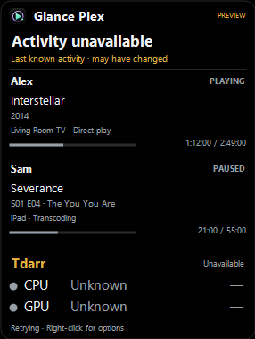
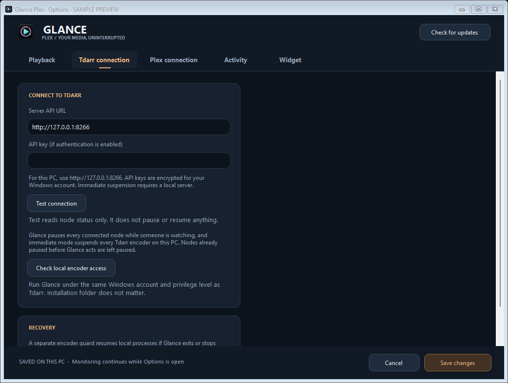
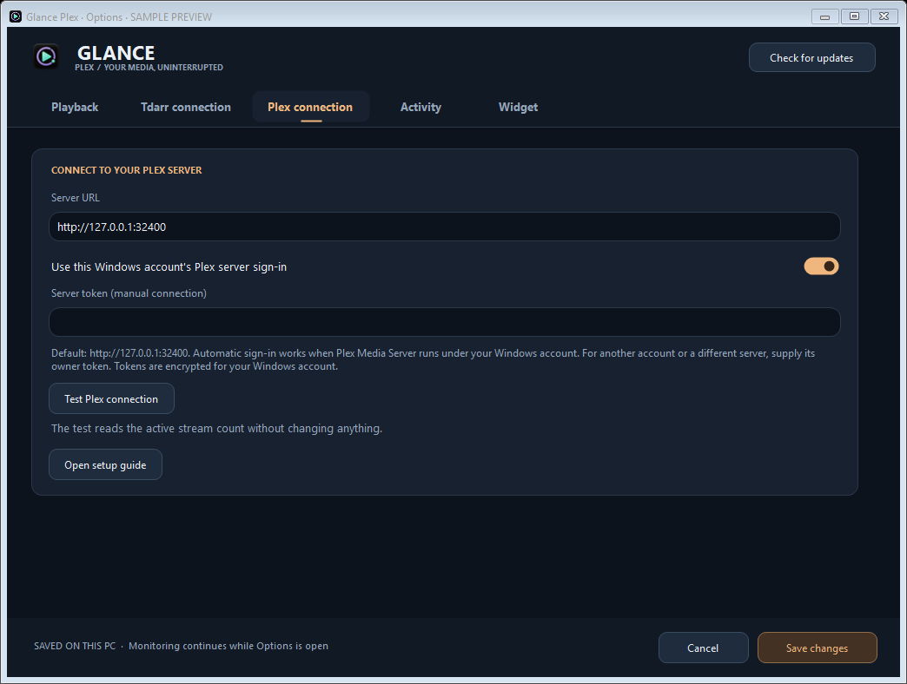
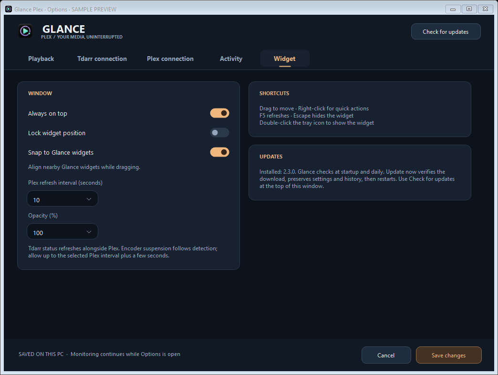

# Glance Plex

A compact Windows widget showing who is watching Plex and what they are playing, with optional Tdarr playback protection and local viewing history.

**[Download the latest release](https://github.com/Brusko25/Glance-Plex-Releases/releases/latest)** · [Setup guide](USER_GUIDE.md) · [Report an issue](https://github.com/Brusko25/Glance-Plex-Releases/issues)

Choose the installer or portable ZIP. Requires Windows 10/11 x64 compatible and .NET Framework 4.8. Same-account Windows Plex connects automatically; Options supports custom connections. Tdarr integration is optional, starts off, and supports local Windows encoder suspension or API queue control. Builds are unsigned.

## Screenshots

Captured from **2.3.0**, using fictional activity and sample hardware percentages, explicitly labeled SAMPLE PREVIEW/PREVIEW. Click for full size.

**Live stream view with CPU/GPU status and percentages**

**Playback protection, resume delay and what happens if Plex can't be reached**

**Local viewing history**

**Suspended encoders, idle server, and unavailable connection**

**Connection setup and widget options**

## New in 2.3.0

- **Simple Tdarr pausing.** While anyone is watching Plex, playing or paused, Glance pauses every Tdarr node, including nodes that connect during playback. When no one has been watching for the resume delay (5 minutes by default), it resumes them. Node selection and the older stream filters are gone.
- **On by default.** Automatic pausing is on for new installs, and updating turns it on once. You can turn it off in Options → Playback.
- **New app icon.**

## Included from 2.2.3 and earlier

- **Tdarr no longer stays paused when Plex disappears (2.2.3).** If Plex can't be reached while Tdarr is paused (server down or sign-in expired), Tdarr resumes after 10 minutes and you get a notification. Choose 30 minutes, 1 hour or Never in **Options → Playback**.
- **Credentials stay off plain http outside your home network.** Plex tokens and Tdarr API keys are sent over http only to local, private-network or Tailscale addresses; use https for anything else.
- **Clearer status.** A paused node that disconnects shows "waiting to reconnect" instead of a connection error, and an encoder guard that keeps stopping retries with a growing delay (up to 60 seconds) instead of every second.
- Viewing history shows "Sep 21 8:00 PM" instead of running the date and time together, saves from two threads take turns, and the widget reuses its fonts.

Exiting the widget no longer throws an exception: resource cleanup runs once and handles an already-cleared tray menu.

Playback protection now tolerates brief file-access conflicts between the widget and its encoder guard. The guard retires after about a minute with nothing paused and restarts when protection is needed. Recovery-journal saves are retried after temporary write failures.

History saves immediately for session and state changes, with routine progress saved at most once a minute and flushed when the app closes. Settings and history writes are flushed before replacement. Windows shutdown uses a short cleanup without cancelling the shutdown; unfinished queue recovery remains saved for the next launch.

CPU/GPU percentages, shared Glance snapping, playback options and verified in-app updates remain available. Percentages show this PC's overall usage, independently of Tdarr worker status. Snapping requires compatible protocol v1 apps. Usage pairing and physical mixed-DPI/virtual-desktop switching remain unverified.

## Playback protection and history

- Pause local Tdarr encoders when Plex playback is detected; resume after five idle minutes by default, adjustable from 0–60 minutes. If Plex can't be reached, Tdarr resumes after 10 minutes by default. Pauses every node while anyone is watching. Includes a recovery helper and an off switch.
- CPU/GPU worker status lights, configurable Plex/Tdarr addresses, credential fields, and read-only connection/access tests.
- Searchable local activity history with observed viewing duration, retention, recording toggle and clear control.
- **Update now** downloads, verifies, installs and restarts while preserving settings/history. Installed and portable copies are supported. Upgrade from 1.0.1 manually once to get this feature.

Immediate suspension requires accessible native Windows Tdarr processes on the same PC. Queue-only mode supports other API-connected nodes while current jobs finish. Tested with Windows Tdarr 2.89.01; see the guide for compatibility and process-permission limits. Duration records cover only activity observed while Glance runs.

Downloads contain only the app and documentation. Never share your running app folder: its local data includes private history and account-encrypted credentials. Update requests send no activity or credentials to GitHub.

This public repository hosts documentation, screenshots, downloads and checksums. Source and development history remain private. Glance Plex is independent and not affiliated with Plex or Tdarr.
