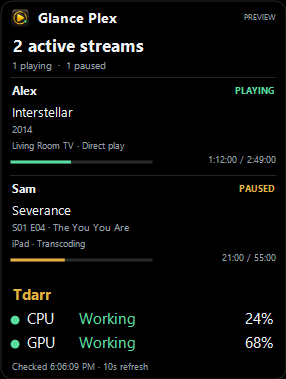
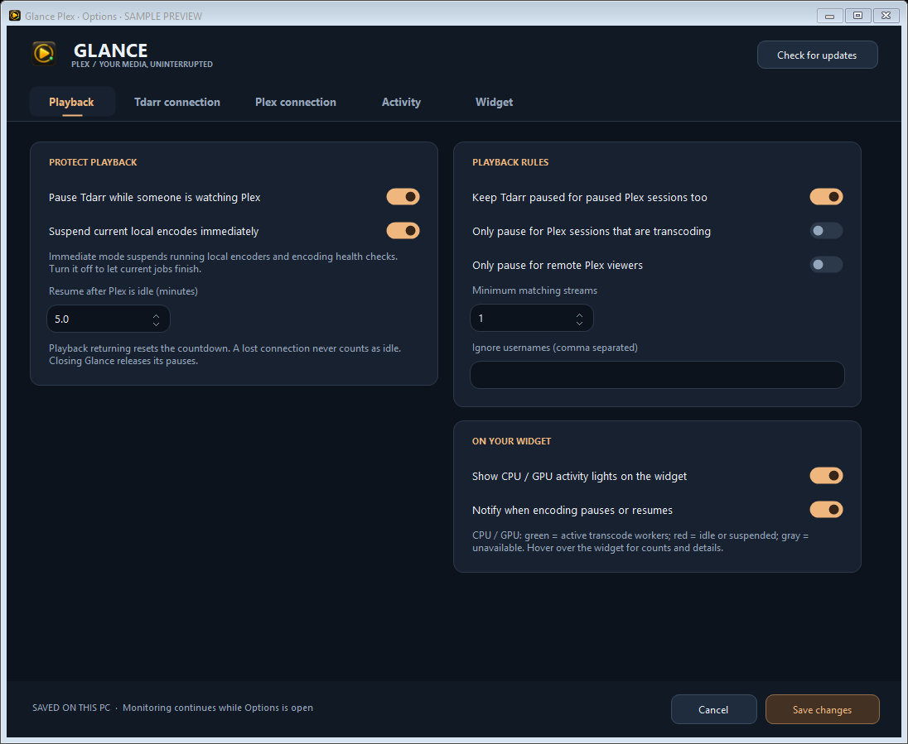
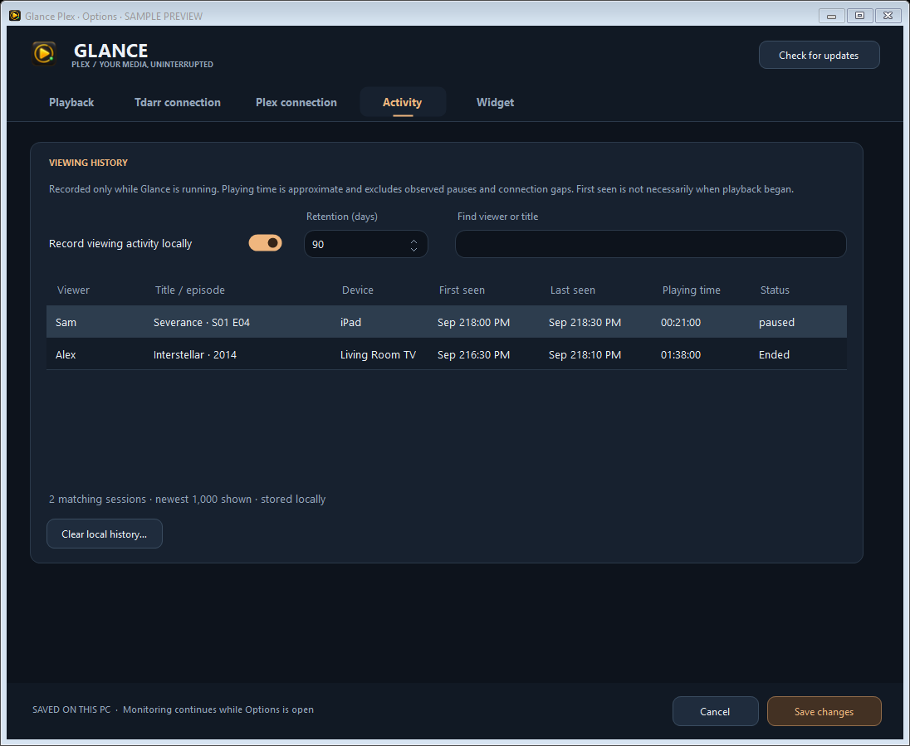
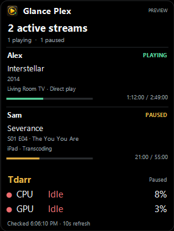
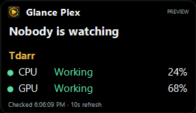
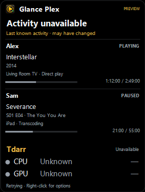
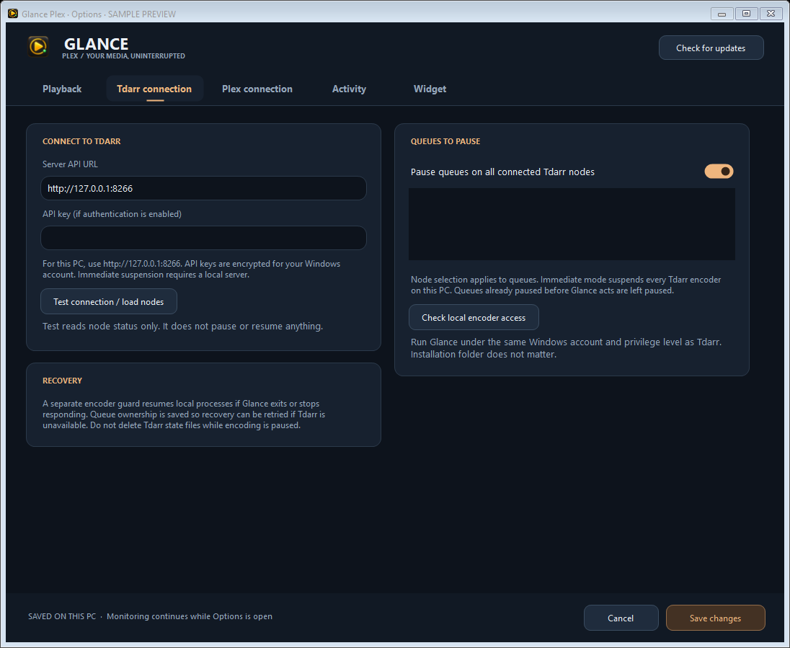
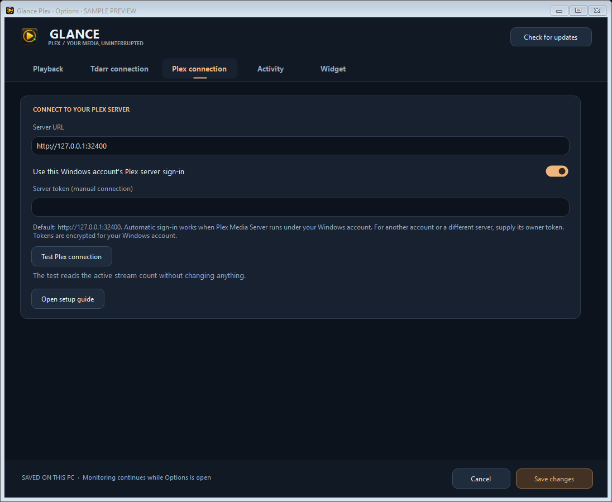
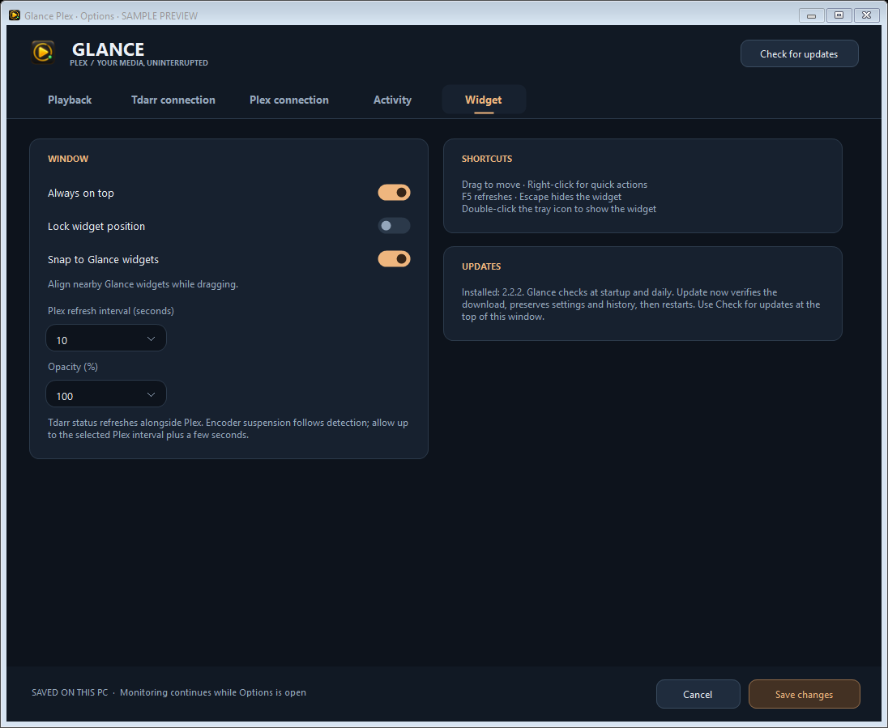

# Glance Plex

A compact Windows widget showing who is watching Plex and what they are playing, with optional Tdarr playback protection and local viewing history.

**[Download the latest release](https://github.com/Brusko25/Glance-Plex-Releases/releases/latest)** · [Setup guide](USER_GUIDE.md) · [Report an issue](https://github.com/Brusko25/Glance-Plex-Releases/issues)

Choose the installer or portable ZIP. Requires Windows 10/11 x64 compatible and .NET Framework 4.8. Same-account Windows Plex connects automatically; Options supports custom connections. Tdarr integration is optional, starts off, and supports local Windows encoder suspension or API queue control. Builds are unsigned.

## Screenshots

Captured from **2.2.2**, using fictional activity and sample hardware percentages, explicitly labeled SAMPLE PREVIEW/PREVIEW. Click for full size.

**Live stream view with CPU/GPU status and percentages**

**Playback protection and adjustable resume delay**

**Local viewing history**

**Suspended encoders, idle server, and unavailable connection**

**Connection setup and widget options**

## New in 2.2.2

Fixes an exception when exiting the widget: closing its window and leaving the main application scope could dispose the same tray menu twice. Resource cleanup now runs once and also handles an already-cleared tray menu.

## Included from 2.2.1

Playback protection now tolerates brief file-access conflicts between the widget and its encoder guard. The guard retires after about a minute with nothing paused and restarts when protection is needed. Recovery-journal saves are retried after temporary write failures.

History saves immediately for session and state changes, with routine progress saved at most once a minute and flushed when the app closes. Settings and history writes are flushed before replacement. Windows shutdown uses a short cleanup without cancelling the shutdown; unfinished queue recovery remains saved for the next launch.

CPU/GPU percentages, shared Glance snapping, playback options and verified in-app updates remain available. Percentages show this PC's overall usage, independently of Tdarr worker status. Snapping requires compatible protocol v1 apps. Usage pairing and physical mixed-DPI/virtual-desktop switching remain unverified.

## Playback protection and history

- Pause local Tdarr encoders when Plex playback is detected; resume after five idle minutes by default, adjustable from 0–60 minutes. Includes recovery helper, queue selection, playback filters, and an off switch.
- CPU/GPU worker status lights, configurable Plex/Tdarr addresses, credential fields, and read-only connection/access tests.
- Searchable local activity history with observed viewing duration, retention, recording toggle and clear control.
- **Update now** downloads, verifies, installs and restarts while preserving settings/history. Installed and portable copies are supported. Upgrade from 1.0.1 manually once to get this feature.

Immediate suspension requires accessible native Windows Tdarr processes on the same PC. Queue-only mode supports other API-connected nodes while current jobs finish. Tested with Windows Tdarr 2.89.01; see the guide for compatibility and process-permission limits. Duration records cover only activity observed while Glance runs.

Downloads contain only the app and documentation. Never share your running app folder: its local data includes private history and account-encrypted credentials. Update requests send no activity or credentials to GitHub.

This public repository hosts documentation, screenshots, downloads and checksums. Source and development history remain private. Glance Plex is independent and not affiliated with Plex or Tdarr.
