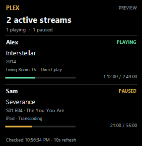
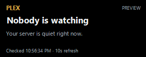
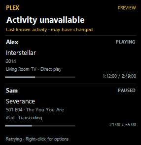

# Glance Plex

A compact Windows desktop widget that shows who is watching your Plex server, what they are playing, and playback progress. Connects automatically to Plex Media Server on the same PC.

**[Download the latest release](https://github.com/Brusko25/Glance-Plex-Releases/releases/latest)** · [Setup guide](USER_GUIDE.md) · [Report an issue](https://github.com/Brusko25/Glance-Plex-Releases/issues)

Choose the Windows installer or portable ZIP. Requires Windows 10/11 x64 compatible, .NET Framework 4.8, and Plex Media Server running under the same Windows account on the default local port. Builds are unsigned. Updates are manual.

## Screenshots

Captured from Glance Plex 1.0.0. These previews use fictional sample activity; no personal account data is included. Click an image for full size.

**Playing and paused streams** — usernames, titles, devices, and progress.

**Idle server** — a successful connection with no active sessions.

**Connection unavailable** — previous activity clearly marked as last known.

## Features

- Active stream count with distinct playing and paused status.
- Viewer, movie or episode, playback device, progress, and playback method when available.
- Automatic local Plex connection and refresh every 10 seconds by default.
- Draggable widget, system tray, adjustable opacity, always on top, and position lock.
- Optional desktop shortcut and Windows startup in the installer.

The token stays on your PC and is sent only to your local Plex server. No credentials, user settings, real activity screenshots, or application source are shipped in this public repository.

This repository hosts public documentation, screenshots, downloads, and checksums. Application source and development history are maintained privately. Glance Plex is an independent utility and is not affiliated with Plex.
